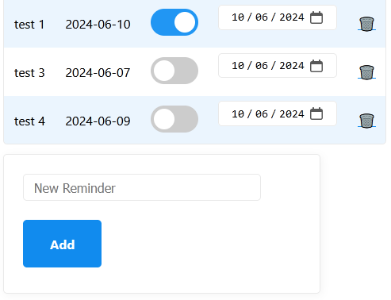

# Daily reminder

---

## Introduction

Lots of daily stuff to do. Taking supplement pills, checking website updates, daily mission of game ... etc.
Sometimes can't remember if already took pill or finished daily mission of game today. So I develop this small tool to help myself.

## Installation

PHP [Fat-free](https://fatfreeframework.com) Framework is used. After installing the framework with one simple command, do the following:
1. Create 'tmp' folder, chmod to writable
2. Create 'data' folder, chmod to writable
3. [Setup your web server](https://fatfreeframework.com/3.8/routing-engine#DynamicWebSites) (Apache/Nginx). I use Apache. That means I need to enable RewriteEngine and create .htaccess

## How to Use

Instead of DB, JSON ... etc, file date is used in this project.
Just click on the toggle button to update file date.
You can use the calendar on the right to modify the date manually.

## Screenshot

